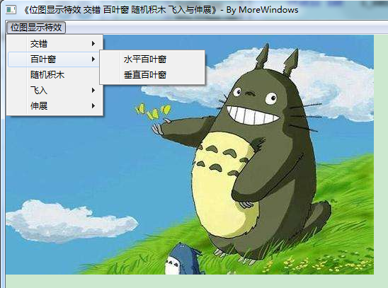

	Windows界面编程之位图显示特效
	By MoreWindows
	博客：http://blog.csdn.net/MoreWindows
	微博：http://weibo.com/MoreWindows
	-----------------------------------------------------------
	    Windows界面编程之位图显示特效系列目录：
	1. 《Windows界面编程第九篇 位图显示特效 交错效果》
	http://blog.csdn.net/morewindows/article/details/8696720
	2. 《Windows界面编程第十篇 位图显示特效 百叶窗效果》
	http://blog.csdn.net/morewindows/article/details/8696722
	3. 《Windows界面编程第十一篇 位图显示特效 随机积木效果》
	http://blog.csdn.net/morewindows/article/details/8696724
	4. 《Windows界面编程第十二篇 位图显示特效 飞入效果与伸展效果》
	http://blog.csdn.net/morewindows/article/details/8696726
	5. 《Windows界面编程第十三篇 位图显示特效合集》
	http://blog.csdn.net/morewindows/article/details/8696730

